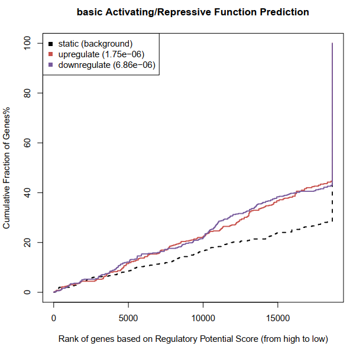
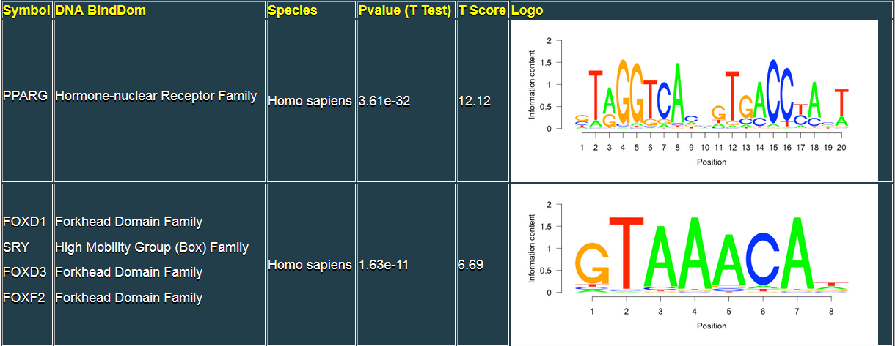

**Binding and Expression Target Analysis (BETA)**


该分析整合了ChIP-seq和转录表达水平来探究基因表达调控的机理。此前，一些研究用于转录因子靶基因预测，但是鲜有高效的工具供人们使用。

作者开发了名为BETA的软件来研究结合位点与转录表达的关系，基于结合位点信息和差异表达信息可以进行如下三个主要分析：

​	（1）用于预测转录因子就有激活或抑制的功能；

​	（2）用于推断转录因子的靶基因；

​	（3）用于鉴定转录因子的motif及其结合者。


该软件具有三个主要的子命令：

**第一部分：**

BETA basic： 转录因子激活或抑制功能预测和直接靶基因检测。

```shell
BETA basic \
	–p peaks.bed \
	–e expr.xls  \
	–k BSF  \
	–g hg19 \
	--da 500 \
	–n prefix \
	-o outdir 
```

涉及参数及其他 可选参数解释如下：

-p	peaks结合位点文件，BED格式，支持3列或5列格式，其格式为：

​	CHROM, START, END（NAME, SCORE）。

使用基本的3列信息即可。

示例如下（不包含表头）：

| #chrom | start   | end     | name（可选） | score（可选） |
| :----- | ------- | ------- | ------------ | ------------- |
| chr1   | 1208689 | 1209509 | AR_LNCaP_2   | 51.58         |
| chr1   | 1334246 | 1335348 | AR_LNCaP_7   | 54.55         |
| chr1   | 2179351 | 2180790 | AR_LNCaP_9   | 257.72        |

###macs2检峰时刻通过p-value进行peak的过滤只保留10000个结果。


-e	差异表达文件，可以使用LIMMA和Cuffdiff的结果，也可使用BETA specific format（BSF）格式，其格式如下：

| GeneID    | log2(FC)  | FDR/pval |
| --------- | --------- | -------- |
| NM_000015 | 1.28221   | 0.185744 |
| NM_000016 | 0         | 1        |
| NM_000017 | 0.0598207 | 0.844755 |


-k	差异表达文件的类型，即LIM, CUF, BSF, O，分别对应LIMMA、cuffdiff标准输出格式、BSF格式或其他格式的文件需要使用--info指定。

-g	基因组，支持任何小鼠，hg38, hg19, hg18, mm10, mm9，也可使用-r指定其他基因组文件。

--gname2	给定次参数说明文件中的基因名称或转录本名称是官方的基因symbols，默认FALSE。

--info	指定表达数据中的geneID, up/down status和statistcal values列。

-r	参考基因组文件。

-o	输出路径。

--bl	是否使用CTCF边界过滤基因周围的peaks，默认FALSE。

--bf	CTCF保守peakBED文件，需要同时指定--bl参数且基因组不能指定为hg19和mm9。

--pn	打算分析的peaks数目，默认10000。

--method	支持score和distance，指定TF/CR给你预测的方法，score：调控潜能的打分，disrance：邻近的结合peak的距离。

-n	输出文件前缀名称。

-d	从TSS一定范围内获取peaks，默认100000（100kb）。

--df	输入一个0~1范围内的阈值来筛选最显著的差异表达基因，默认1，全部输入基因。

--da	通过比例或数目选取最显著的差异表达基因，默认0.5。如果想使用diff_fdr请设置此参数为1。

-c	设置0~1阈值，通过p值（单尾KS检验）选择最近的靶基因，默认0.001。


测试运行日志如下：

```
BETA basic \
  -p ../peaks.bed \
  -e ../beta_specific_expression.txt \
  -k BSF \
  -g hg19 \
  --da 500 \
  -n basic \
  -o basic_out

[15:41:26] Argument List:
[15:41:26] Name = basic
[15:41:26] Peak File = ../peaks.bed
[15:41:26] Top Peaks Number = 10000
[15:41:26] Distance = 100000 bp
[15:41:26] Genome = hg19
[15:41:26] Expression File = ../beta_specific_expression.txt
[15:41:26] BETA specific Expression Type
[15:41:26] Number of differential expressed genes = 500.0
[15:41:26] Differential expressed gene FDR Threshold = 1
[15:41:26] Up/Down Prediction Cutoff = 0.001000
[15:41:26] Function prediction based on regulatory potential
[15:41:26] Check ../peaks.bed successfully!
[15:41:26] #ID  Status  Value
 is the header of the expression file
[15:41:26] Checking the differential expression infomation...
[15:41:26] Take the first line with Differential Information as an example: NM_000014   -0.325878       0.618293

[15:41:26] Differential Expression file format successful passed
[15:41:26] You do not like filter peak by CFCT boundary, it will be filtered only by the distance
[15:41:26] Read file <../peaks.bed> OK! All <7031> peaks.
[15:41:41] Process <50801> genes
[15:41:56] Finished! Preliminary results saved into temporary file: <basic.txt>
[11815, 11643]
[15:41:56] Genes were seprated to two parts: up regulated and down regulated.
cut: write error: Broken pipe
cut: write error: Broken pipe
[15:41:56] Prepare file for the Up/Down Test
null device
          1
[15:42:02] Finished, Find the result in basic_function_prediction.pdf
[15:42:02] Get the Rank Product of the "upregulate" genes
[15:42:46] Get the Rank Product of the "downregulate" genes
['"upregulate"', '"downregulate"']
[15:43:30] pick out the peaks 100000bp around the selected genes
[15:43:30] Finished: Find target gene associated peaks in basic_out
total time: 0:2:4
```

输出文件存储于basic_out文件夹：

```shell
$tree
.
├── basic_downtarget_associate_peaks.bed
├── basic_downtarget.txt
├── basic_function_prediction.pdf
├── basic_function_prediction.R
├── basic_uptarget_associate_peaks.bed
└── basic_uptarget.txt
```

1. 激活/抑制功能预测打分



2. 上调调控靶标/下调调控靶标文件（basic_uptarget.txt，basic_downtarget.txt）

```
#文件截取示例
Chroms  txStart txEnd   refseqID        rank product    Strands GeneSymbol
chr1    27992571        27998724        NM_002038       4.592e-06       -       IFI6
chr12   113376237       113411055       NM_006187       4.835e-06       +       OAS3
chr12   113344738       113357712       NM_016816       5.523e-06       +       OAS1
chr4    169277885       169401665       NM_001012967    5.616e-06       -       DDX60L
```

#以基因为中心

3. 靶基因相关的peak文件（是以peak为中心）

```
chrom   pStart  pEnd    Refseq  Symbol  Distance        Score
chr1    27971570        27971739        NM_002038       IFI6    -27070  0.205399174599
chr1    27971776        27971885        NM_002038       IFI6    -26894  0.20685028671
chr12   113364362       113364438       NM_006187       OAS3    -11837  0.377766121894
chr12   113364362       113364438       NM_016816       OAS1    19662   0.276241443606
chr4    169422368       169422769       NM_001012967    DDX60L  20903   0.262863603291
```

#以peak为中心


**第二部分：**

BETA plus：进行激活/抑制功能预测， 直接靶基因预测和靶向区域motif分析，比基础版本增加了motif分析

```
BETA plus \
	–p peaks.bed \
	–e expr.xls  \
	–k BSF \
	–g hg19 \
	--gs hg19.fa \
	--bl
```

该模块与basic相似，以下参数功能有差异：

--gs	基因序列文件。

--mn	指定0~1范围内数值作为p-value或大于1作为数目来获取motif的阈值， 默认10。

其他参数参考**BETA Basic**参数描述。


测试运行日志如下：

```
[16:49:30] Argument List:
[16:49:30] Name = NA
[16:49:30] Peak File = ../peaks.bed
[16:49:30] Top Peaks Number = 10000
[16:49:30] Distance = 100000 bp
[16:49:30] Genome = hg19
[16:49:30] Expression File = ../beta_specific_expression.txt
[16:49:30] Genome Sequence fasta formated data = hg19.fa
[16:49:30] BETA specific Expression Type
[16:49:30] Number of differential expressed genes = 0.5
[16:49:30] Differential expressed gene FDR Threshold = 1
[16:49:30] Up/Down Prediction Cutoff = 0.001000
[16:49:30] Function prediction based on regulatory potential
[16:49:30] Check ../peaks.bed successfully!
[16:49:30] #ID  Status  Value
 is the header of the expression file
[16:49:30] Checking the differential expression infomation...
[16:49:30] Take the first line with Differential Information as an example: NM_000014   -0.325878       0.618293

[16:49:30] Differential Expression file format successful passed
[16:49:30] Read file <../peaks.bed> OK! All <7031> peaks.
[16:50:16] Process <50801> genes
[16:50:25] Finished! Preliminary results saved into temporary file: <NA.txt>
[11815, 11643]
[16:50:25] Genes were seprated to two parts: up regulated and down regulated.
cut: write error: Broken pipe
cut: write error: Broken pipe
[16:50:26] Prepare file for the Up/Down Test
null device
          1
[16:51:03] Finished, Find the result in NA_function_prediction.pdf
[16:51:03] Get the Rank Product of the "upregulate" genes
[16:51:45] Get the Rank Product of the "downregulate" genes
['"upregulate"', '"downregulate"']
[16:52:26] pick out the peaks 100000bp around the selected genes
[16:52:27] Finished: Find target gene associated peaks in plus_out
[16:52:27] get three regions of every peak around the up genes
['up_middle.bed', 'up_left.bed', 'up_right.bed']
[16:53:54] get the fasta format sequence data of the three regions of up
[16:53:55] get three regions of every peak around the down genes
['down_middle.bed', 'down_left.bed', 'down_right.bed']
[16:55:14] get the fasta format sequence data of the three regions of down
[16:55:14] get three regions of every peak around the non genes
['non_middle.bed', 'non_left.bed', 'non_right.bed']
[16:56:37] get the fasta format sequence data of the three regions of non
[16:56:37] run mis to do the known motif scan with cistrome motif database
Calculating Background..
A or T: 93234
C or G: 100766
Others: 0
Calculating Background..
A or T: 97696
C or G: 95334
Others: 0
Calculating Background..
A or T: 97264
C or G: 95766
Others: 0
Calculating Background..
A or T: 118812
C or G: 142588
Others: 0
Calculating Background..
A or T: 125071
C or G: 135022
Others: 0
Calculating Background..
A or T: 123892
C or G: 136201
Others: 0
Calculating Background..
A or T: 181589
C or G: 169211
Others: 0
Calculating Background..
A or T: 191633
C or G: 157413
Others: 0
Calculating Background..
A or T: 191487
C or G: 157559
Others: 0
[16:59:58] T statistic test performed here to do the significance testing of every motif
[17:58:18] motif result will be in html format
Success parser from table.
Success parser from table.
Success parser from table.
Success parser from table.
Success parser from table.
Success parser from table.
[17:58:22] Done: find motif result in beatmotif.html file
[17:58:22] Done: find all BETA result in plus_out
total time: 1:8:52
```

同样，plus功能生成上/下调靶标文件和靶基因相关的peak文件，此外生成了靶基因相关motif的结果文件（存放于motifresult文件夹，包含一个*motif.html的motif分析文件）。

motif分析示例截图如下：



同时生成上调、下调差异差异motif的文件：

**MotifID	Species	Symbol	DNA BindDom	PSSM	Tscore	Pvalue**

MS00266	Homo sapiens	MLX	Helix-Loop-Helix Family	[[[0.534, 0.012, 0.331, 0.123], [0.01, 0.043, 0.152, 0.795], [0.011, 0.963, 0.011, 0.015], [0.955, 0.01, 0.025, 0.01], [0.01, 0.97, 0.01, 0.01], [0.01, 0.01, 0.97, 0.01], [0.01, 0.01, 0.01, 0.97], [0.01, 0.01, 0.97, 0.01], [0.8, 0.03, 0.117, 0.053], [0.066, 0.241, 0.017, 0.676]]]	5.08	4.30e-07

##PSSM：位置特异性得分矩阵（position-specific scoring matrix），PSSM示例格式为: [[0.2,0.3,0.3,0.2],[0.1,0.8,0.05,0.05]]； Tscore：t-test的统计量数值。


另外，官网提供了motif分析结果的展示示例参考：

​	 http://cistrome.org/BETA/motifresult/betamotif.html。


**第三部分：**

用于预测TF的靶基因和激活/抑制功能，属于basic的简化模块。

```shell
BETA minus \
	-p peaks.bed \
	--bl -g hg19 
```

#参数可参考basic参数解释。


**参考资料**

官方使用手册：http://cistrome.org/BETA/tutorial.html

BETA网页版分析入口：http://cistrome.org/BETA/index.html#runweb

转录因子motif知识：https://www.jianshu.com/p/ad82fe903e57


**参考文献**

Wang, S., Sun, H., Ma, J., Zang, C., Wang, C., Wang, J., ... & Liu, X. S. (2013). Target analysis by integration of transcriptome and ChIP-seq data with BETA. **Nature protocols**, 8(12), 2502-2515.